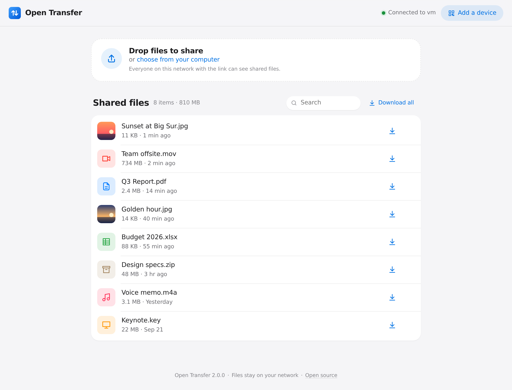
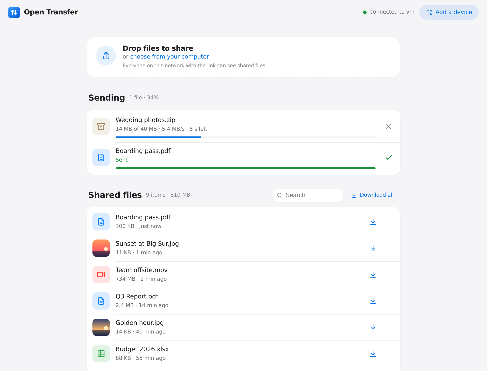
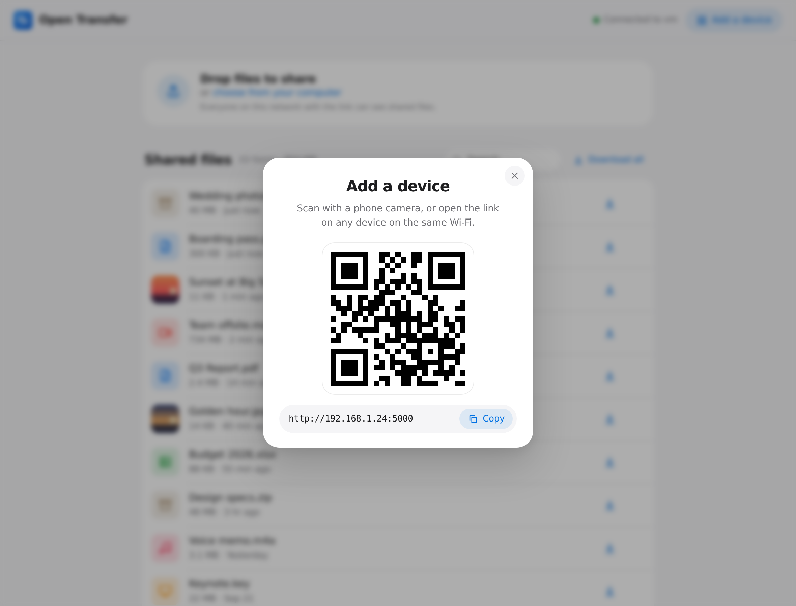
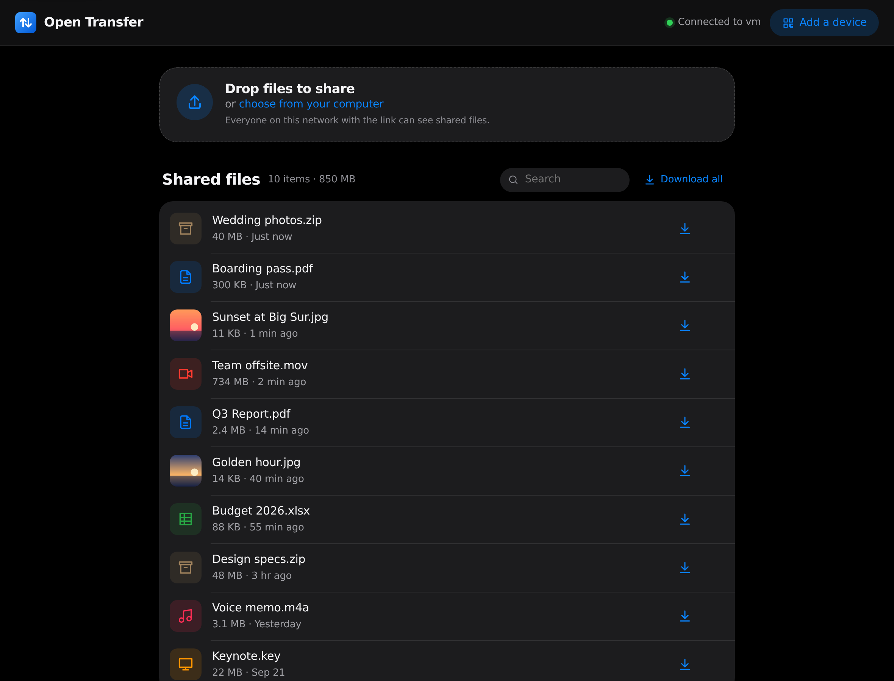
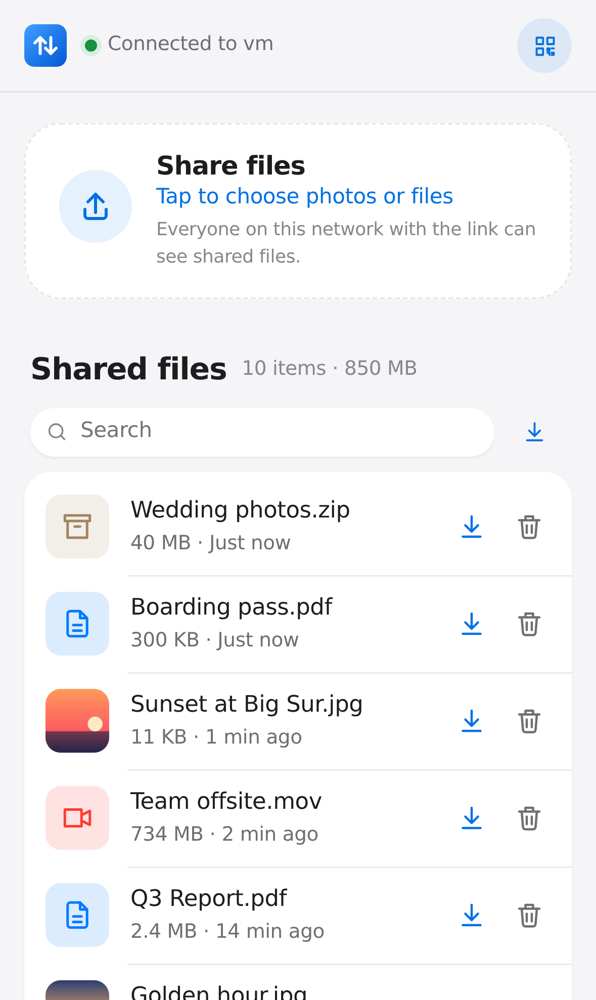
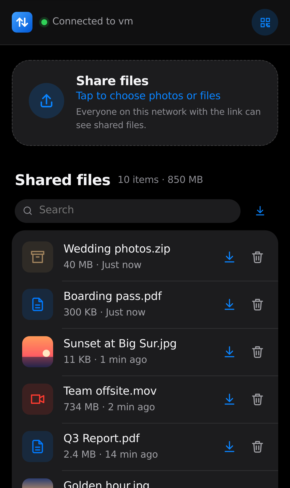
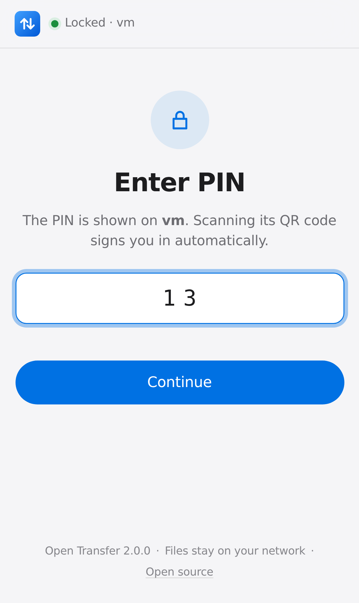
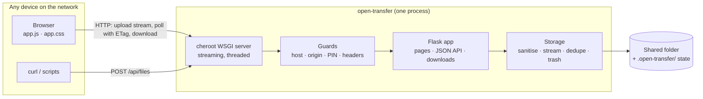

<div align="center" markdown="1">


# Open Transfer

**AirDrop for every device.** Share files between your phone, laptop and anything else on your Wi‑Fi — straight from the browser. No app, no account, no cloud.

**[Website](https://itsonu.github.io/open-transfer/)** · **[Download](https://github.com/itsonu/open-transfer/releases/latest)** · **[Docs](docs/architecture.md)**

[](https://github.com/itsonu/open-transfer/actions/workflows/ci.yml)
[](https://github.com/itsonu/open-transfer/actions/workflows/security.yml)
[](LICENSE)




</div>

---

## Contents

- [Why Open Transfer](#why-open-transfer)
- [Quick start](#quick-start)
- [How it works for your users](#how-it-works-for-your-users)
- [Features](#features)
- [Screenshots](#screenshots)
- [Configuration](#configuration)
- [Security & privacy](#security--privacy)
- [Self-hosting & Docker](#self-hosting--docker)
- [Architecture](#architecture)
- [Development](#development)
- [Troubleshooting](#troubleshooting)
- [Roadmap](#roadmap)
- [Contributing](#contributing) · [License](#license)

## Why Open Transfer

|                       | Open Transfer | AirDrop | Cloud drives |
| --------------------- | :-----------: | :-----: | :----------: |
| Works on any device with a browser (iPhone, Android, Windows, Linux, smart TVs…) | ✅ | Apple only | ✅ |
| Nothing to install on the receiving device | ✅ | ✅ | ❌ app or login |
| Files never leave your network | ✅ | ✅ | ❌ |
| No account, no size caps, no subscription | ✅ | ✅ | ❌ |
| Open source, self-hostable, scriptable (curl) | ✅ | ❌ | ❌ |

Run it on one computer; every other device just opens a link (or scans a QR code).

## Quick start

### Option 1 — Download the app (no Python needed)

Grab the file for your computer from the [latest release](https://github.com/itsonu/open-transfer/releases/latest) and double-click it. A window shows the address, a QR code and where files are saved (`Downloads/Open Transfer`); your browser opens automatically. Close the window to stop sharing.

| Computer | File | First launch |
| -------- | ---- | ------------ |
| **Windows** | `open-transfer-windows-x64.exe` | SmartScreen may warn about an unknown publisher → **More info → Run anyway**. Allow access on **Private networks** when the firewall asks. |
| **macOS** (Apple silicon) | `open-transfer-macos-arm64.tar.gz` | Double-click to unzip, then **right-click → Open** the first time (the app isn’t notarised yet). Intel Macs: build it yourself (below). |
| **Linux** | `open-transfer-linux-x64.tar.gz` | `tar -xzf open-transfer-linux-x64.tar.gz && ./open-transfer` |

The app accepts the same options as the command line, e.g. `open-transfer.exe D:\Share --pin`.

**Build the app yourself** — one command on the OS you want it for (Python 3.10+):

```bash
python3 scripts/build_app.py      # → dist/open-transfer   (Windows: py scripts\build_app.py → dist\open-transfer.exe)
```

It uses an isolated `.build-venv`, bundles everything with PyInstaller into a single ~13 MB file, and checks the result actually starts. CI builds all three platforms on every pull request (downloadable from the run's *Artifacts*), and pushing a `v*` tag attaches them to a GitHub release.

### Option 2 — Run from source

You need **Python 3.10+** ([download](https://www.python.org/downloads/)). Everything else is installed for you in a private `.venv` folder on first run.

**macOS / Linux**

```bash
git clone https://github.com/itsonu/open-transfer.git
cd open-transfer
./run.sh
```

**Windows (PowerShell)**

```powershell
git clone https://github.com/itsonu/open-transfer.git
cd open-transfer
.\run.ps1
```

Your browser opens and the terminal shows the address and a QR code:

```
  Open Transfer  v2.0.0

  On this computer   http://localhost:5000
  On your network    http://192.168.1.24:5000
  Saving files to    /Users/you/open-transfer/uploads

  Scan with your phone's camera:
  ▄▄▄▄▄▄▄ ▄ ▄▄ ▄▄▄▄▄▄▄
  █ ▄▄▄ █ ▀█▄▀ █ ▄▄▄ █   …
```

<details markdown="1">
<summary><b>Other ways to run it</b> — pipx, Docker, standalone binary</summary>

| Method | Command |
| ------ | ------- |
| **pipx / uv** (installs the `open-transfer` command) | `pipx install git+https://github.com/itsonu/open-transfer` or `uv tool install git+https://github.com/itsonu/open-transfer` |
| **Docker** | `docker compose up -d` (see [Self-hosting](#self-hosting--docker)) |
| **Standalone app** (no Python needed) | See [Option 1](#option-1--download-the-app-no-python-needed), or build it with `python3 scripts/build_app.py` |
| **From source, manually** | `python -m venv .venv && .venv/bin/pip install -e . && .venv/bin/open-transfer` |

</details>

**Common recipes**

```bash
./run.sh ~/Desktop/Share          # share a specific folder
./run.sh ~/Share --pin            # require a PIN (a random one is generated and shown)
./run.sh --receive-only           # a private inbox: others can send, only you see files
./run.sh --read-only ~/Photos     # hand out files without accepting uploads
./run.sh --max-size 2G --no-delete
```

> Put the folder **before** `--pin` — `--pin` takes an optional value, so `--pin ~/Share` would treat the path as the PIN.

## How it works for your users

1. **Start** Open Transfer on any computer.
2. **Connect** another device: scan the QR code in the terminal or in the app (**Add a device**), or type the link.
3. **Share**: drop files on the page (or tap to choose photos on a phone). They show up instantly on every connected device, ready to download.

There is no pairing, sign-up or app. If you set a PIN, the QR code includes it, so scanning is still one step.

## Features

**Sharing**
- Drag and drop anywhere on the page, pick files, or **paste** (⌘V / Ctrl+V) screenshots and files
- Multiple files at once, sent 3 in parallel, streamed straight to disk — **no size limit** except your free space
- Live progress per file with **speed and time remaining**, cancel and **retry**
- Files appear on every connected device automatically (efficient `ETag` polling — no refresh)
- **Download all** (or all search results) as one ZIP, streamed on the fly
- Resumable downloads and video seeking (HTTP range requests)
- Image thumbnails, file-type icons, search, relative times
- **Undo** after deleting (files stay restorable for 30 seconds)
- Duplicate names are kept, not overwritten: `photo.jpg`, `photo (1).jpg`
- Unicode names work: `Café 照片.pdf`

**Experience**
- Clean, native-feeling interface with automatic **dark mode**, fluid motion that respects **Reduce Motion**, and layouts tuned for phones, tablets and desktops
- Clear states everywhere: loading skeletons, empty states, offline/reconnecting indicator, per-file errors, success toasts
- Accessible: keyboard operable, visible focus, screen-reader labels, live regions, semantic landmarks
- Works fully **offline on a LAN** — no CDNs, fonts or trackers
- Installable to the home screen (web app manifest)

**Operating it**
- One-command start on macOS, Linux and Windows; free-port fallback (macOS uses 5000 for AirPlay)
- Optional **PIN** with brute-force rate limiting; **receive-only**, **read-only** and **no-delete** modes
- Docker image, reverse-proxy support, `/api/health` endpoint, and a small [HTTP API](docs/api.md) for scripts and `curl`

## Screenshots

| Sending with live progress | Add a device | Dark mode |
| :---: | :---: | :---: |
|  |  |  |

| iPhone | iPhone, dark | PIN screen |
| :---: | :---: | :---: |
|  |  |  |

Screenshots are generated from the real app by [`scripts/screenshots.py`](scripts/screenshots.py).

## Configuration

Every option works as a command-line flag or an environment variable (flags win).

| Flag | Environment variable | Default | What it does |
| ---- | -------------------- | ------- | ------------ |
| `DIRECTORY` | `OPEN_TRANSFER_DIR` | `./uploads` | Folder to share and save uploads into |
| `-p, --port` | `OPEN_TRANSFER_PORT` | `5000` | Port (the next free one is used if it's busy) |
| `--host` | `OPEN_TRANSFER_HOST` | `0.0.0.0` | Interface to listen on; `127.0.0.1` = this computer only |
| `--pin [PIN]` | `OPEN_TRANSFER_PIN` | off | Require a PIN (4–32 letters/digits). No value = random 4 digits |
| `--max-size` | `OPEN_TRANSFER_MAX_SIZE` | unlimited | Largest single upload, e.g. `500M`, `4G`, `2GiB` |
| `--receive-only` | `OPEN_TRANSFER_RECEIVE_ONLY=1` | off | Visitors can send but not see or download files |
| `--read-only` | `OPEN_TRANSFER_READ_ONLY=1` | off | Visitors can download but not upload or delete |
| `--no-delete` | `OPEN_TRANSFER_NO_DELETE=1` | off | Visitors can't delete files |
| `--public-url` | `OPEN_TRANSFER_PUBLIC_URL` | auto | Address shown in the QR code (Docker, proxies, DNS names) |
| `--allow-host NAME` | `OPEN_TRANSFER_ALLOWED_HOSTS` (comma-separated) | — | Extra host names to accept (see [DNS rebinding](#security--privacy)); `*` disables the check |
| `--behind-proxy` | `OPEN_TRANSFER_BEHIND_PROXY=1` | off | Trust `X-Forwarded-*` from one reverse proxy |
| `--no-browser` | `OPEN_TRANSFER_NO_BROWSER=1` | off | Don't open a browser on start |
| `--no-qr` | `OPEN_TRANSFER_NO_QR=1` | off | Don't print the QR code |
| `-v, --verbose` | — | off | Log every request |

## Security & privacy

Open Transfer is designed for **trusted local networks** (home, office, a hotspot you control).

**What it does for you**
- Files go directly between devices on your network. Nothing is sent to any third party; the page loads no external resources.
- **PIN mode** protects the page, file list, downloads and uploads. Wrong PINs are rate-limited (5 per minute per device). Sessions are signed cookies (`HttpOnly`, `SameSite=Lax`) and become invalid if you change the PIN.
- **Path traversal** is impossible: names are sanitised (`../../etc/passwd` → `passwd`), hidden files and symlinks are never served, and every path is checked to be inside the shared folder.
- **Cross-site request forgery** is blocked: browsers can only upload or delete from the Open Transfer page itself.
- **DNS rebinding** is blocked: requests must address the server by IP, `localhost`, a `.local`/`.lan`-style name, this computer's name, or a name you allow with `--allow-host`.
- A strict **Content-Security-Policy** and other hardening headers; shared files are always served as downloads (never rendered as HTML), with a sandbox CSP.
- Half-finished uploads are never visible and are cleaned up automatically.

**What you should know**
- Without a PIN, **anyone on the same network who opens the link can see, download and delete files**. Use `--pin` on shared or public Wi‑Fi, or `--receive-only` to collect files privately.
- Traffic is plain HTTP on your LAN. For encryption, put it behind an HTTPS reverse proxy — see [docs/self-hosting.md](docs/self-hosting.md).
- It is not meant to be exposed directly to the internet.

Found a vulnerability? Please report it privately — see [SECURITY.md](SECURITY.md).

## Self-hosting & Docker

```bash
docker compose up -d        # builds the image and serves ./uploads on port 5000
```

Or use the image published with each release, without cloning:

```bash
docker run -d --name open-transfer -p 5000:5000 -v "$PWD/uploads:/data" \
  -e OPEN_TRANSFER_PUBLIC_URL=http://192.168.1.24:5000 ghcr.io/itsonu/open-transfer
```

Inside a container the app can't see your LAN address, so set `OPEN_TRANSFER_PUBLIC_URL` to make the QR code point to the right place. The image runs as a non-root user and has a built-in health check.

HTTPS with Caddy or nginx, running as a systemd service, and NAS tips: **[docs/self-hosting.md](docs/self-hosting.md)**.

## Architecture

A single, dependency-light Python process serves a static, build-free web app and a small JSON API.



| Module | Responsibility |
| ------ | -------------- |
| `cli.py` | Parses flags/env, picks a free port, prints the banner & QR, runs the server |
| `app.py` | Flask factory: routes, auth, error handling (JSON for API, pages for browsers) |
| `storage.py` | Safe names, streaming writes via `.part` files + atomic rename, dedupe, soft delete |
| `security.py` | DNS-rebinding and CSRF checks, PIN comparison, rate limiting, security headers |
| `archive.py` | Streams "Download all" ZIPs without temp files |
| `network.py` | LAN address detection, host name, free-port search |
| `static/`, `templates/` | The web app: vanilla ES module + CSS, no build step |

Design decisions and data flow in detail: **[docs/architecture.md](docs/architecture.md)**.

## Development

```bash
make setup     # venv + dev tools + git hooks + Playwright Chromium
make dev       # run on a scratch folder with request logging
make check     # everything CI runs: lint, types, unit + browser tests
```

| Command | What it does |
| ------- | ------------ |
| `make test` | Unit & API tests (pytest) |
| `make e2e` | Real-browser tests with Playwright against a live server |
| `make lint` / `make fmt` | Ruff lint + format, JS syntax check |
| `make typecheck` | mypy (strict) |
| `make audit` | Dependency vulnerability scan (pip-audit) |
| `make cov` | Coverage report |
| `make docker` / `make app` | Container image / standalone app (`scripts/build_app.py`) |

The front end is plain HTML, CSS and a single ES module in `src/open_transfer/static/` — edit and reload, no bundler. CI runs on Linux, macOS and Windows across Python 3.10–3.14, plus browser tests, a Docker smoke test, CodeQL and dependency audits.

## Troubleshooting

<details markdown="1">
<summary><b>My phone can't open the link</b></summary>

- Make sure both devices are on the **same Wi‑Fi**. Guest networks and some routers isolate devices from each other ("AP/client isolation").
- Allow Python through your firewall. **Windows** asks on first run — tick *Private networks*. **macOS**: System Settings → Network → Firewall → allow *python*. **Linux (ufw)**: `sudo ufw allow 5000/tcp`.
- If the computer has several network adapters (VPN, Docker, virtual machines), try the other addresses listed under **Add a device → Other addresses**.
</details>

<details markdown="1">
<summary><b>"Port 5000 is busy, using 5001 instead"</b></summary>

On macOS, AirPlay Receiver uses port 5000. Open Transfer picks the next free port automatically — use the address it prints, or choose one with `--port 8080`.
</details>

<details markdown="1">
<summary><b>"Requests for '…' are not accepted"</b></summary>

You're reaching the server by a host name it doesn't recognise (DNS-rebinding protection). Start it with `--allow-host that.name` or use the IP address.
</details>

<details markdown="1">
<summary><b>Uploads fail behind nginx</b></summary>

nginx limits request bodies to 1 MB by default. Set `client_max_body_size 0;` and `proxy_request_buffering off;` — see [docs/self-hosting.md](docs/self-hosting.md).
</details>

## Roadmap

- [ ] Folder uploads that keep their structure
- [ ] Automatic discovery with mDNS / Bonjour (`http://open-transfer.local`)
- [ ] Share text snippets and links, not just files
- [ ] Resumable uploads for flaky Wi‑Fi (chunked, tus-compatible)
- [ ] Built-in HTTPS with a local certificate
- [ ] Optional auto-expiry of shared files
- [ ] Image/video/PDF preview sheet
- [ ] Translations (i18n)
- [ ] Publish to PyPI and Homebrew

Have an idea? [Open a feature request](https://github.com/itsonu/open-transfer/issues/new/choose).

## Contributing

Contributions of all sizes are welcome — bug reports, docs, design polish and code. Start with **[CONTRIBUTING.md](CONTRIBUTING.md)**; it takes about two minutes to get a dev environment running (`make setup`). Please follow our [Code of Conduct](CODE_OF_CONDUCT.md).

## License

[MIT](LICENSE) © Open Transfer contributors · Maintained by [Chandrabhushan Prakash](https://portfolio-itsonu.vercel.app/)
