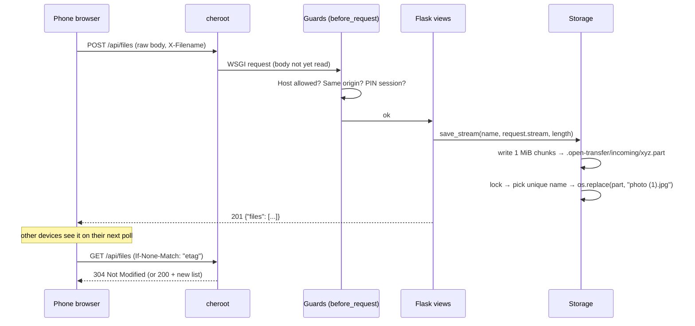

# Architecture

Open Transfer is intentionally small: one Python process, three runtime dependencies (Flask, cheroot, segno), and a front end with no build step. This document explains how the pieces fit and why.

## Goals that shaped the design

1. **Zero setup for the receiving side.** Any browser is a client. No app, account or pairing.
2. **Big files must just work.** Multi-GB videos over Wi‑Fi, without running out of RAM or `/tmp`.
3. **Safe by default on a shared network**, with easy opt-in locking (PIN).
4. **Easy to read, run and contribute to.** A new contributor should understand the whole codebase in an afternoon.

## Layout

```
src/open_transfer/
├── cli.py          entry point: flags/env → Config, free port, banner + QR, cheroot server
├── config.py       Config dataclass, size parsing, env helpers
├── app.py          Flask app factory: guards, pages, JSON API, downloads
├── storage.py      all filesystem access: sanitising, streaming writes, trash
├── security.py     host/origin checks, PIN compare, rate limiter, headers
├── archive.py      streaming ZIP writer for "Download all"
├── network.py      LAN IP detection, host name, free-port search
├── templates/      index.html (app shell), error.html
└── static/         app.js, app.css, manifest, icons
tests/              pytest: storage, API, security, CLI; tests/e2e: Playwright
scripts/            screenshots.py (regenerates docs/screenshots)
packaging/          PyInstaller spec for standalone binaries
```

## Request flow



### Why cheroot, and raw-body uploads

Most WSGI servers (and multipart parsing) **buffer the whole request body** to memory or a temp file before the app sees it. For a 20 GB video that means 20 GB in `/tmp` — often a small partition, or RAM in Docker — and then a second full copy into the shared folder.

[cheroot](https://github.com/cherrypy/cheroot) (CherryPy's production server) hands the app a *streaming* body. The browser sends the file as the raw request body (`XMLHttpRequest.send(file)`) with the name in an `X-Filename` header, and `Storage.save_stream` copies it to disk in 1 MiB chunks. Memory use is constant, the file is written once, and upload progress comes for free from `xhr.upload.onprogress`.

Multipart (`curl -F file=@x`) is still accepted on `/api/files` and the legacy `/transfer` route for scripts; it goes through Werkzeug's parser.

### Atomic, collision-free saves

Uploads land in `<shared>/.open-transfer/incoming/<random>.part`. Only a complete upload (byte count equals `Content-Length`) is published, under a lock, with `os.replace` to a unique name (`photo.jpg`, `photo (1).jpg`, `archive (1).tar.gz`). Nothing half-written is ever listed or downloadable, and leftover `.part` files from a crash are removed on start-up.

### Soft delete ("Undo")

`DELETE /api/files/<name>` moves the file into `.open-transfer/trash/<token>/` and returns the token. `POST /api/trash/<token>/restore` puts it back (renaming if the name was reused meanwhile). Trash entries older than 30 s are purged whenever the list is read.

### Live updates without WebSockets

Clients poll `GET /api/files` every 3 s (20 s when the tab is hidden, exponential back-off while offline) with `If-None-Match`. The server computes a cheap fingerprint of `(name, size, mtime)` and answers `304` when nothing changed, so an idle client costs a few hundred bytes per poll. This keeps the server stateless and thread-per-connection friendly; SSE/WebSockets would pin a server thread per open tab.

### Download all

`archive.py` feeds `zipfile` a write-only, non-seekable sink and yields its buffer after every chunk, so ZIPs of any size stream straight to the client (stored, not deflated — shared media rarely compresses). ZIP64 is always enabled.

## Security model

All guards run in one `before_request` hook, in this order:

| Check | Threat | Behaviour |
| ----- | ------ | --------- |
| Host allow-list | DNS rebinding: a web page re-points its domain at your LAN IP to read files "same-origin" | Accept IP literals, `localhost`, `.local`/`.lan`/`.home.arpa`/…, this machine's name, and `--allow-host` names; else `421` |
| Origin / `Sec-Fetch-Site` on writes | CSRF: a web page auto-submitting uploads/deletes to your LAN server | Browsers always send these on cross-site requests → `403`. curl sends neither → allowed |
| PIN session | Other people on the network | Everything except the app shell, `/api/info`, `/api/auth`, `/api/health` and static files needs a signed session. The session stores a hash of the PIN, so changing the PIN logs everyone out |

Plus:

- `safe_filename` keeps Unicode but strips directories, control and reserved characters, leading dots and Windows device names, and caps the length at 240 bytes. `Storage.resolve` re-checks the name and refuses hidden files, symlinks and anything whose real parent isn't the shared folder.
- Responses carry a strict CSP (`script-src 'self'`, no inline script), `nosniff`, `X-Frame-Options: DENY`, `Referrer-Policy: no-referrer`, COOP/CORP. File downloads add `Content-Security-Policy: sandbox` and are always `attachment`, except `?inline=1` for a short allow-list of image/audio/video types (used for thumbnails).
- PIN attempts are limited to 5 per minute per client address (per forwarded address with `--behind-proxy`) and compared in constant time. The session key is stored in `.open-transfer/secret` (mode 0600) so logins survive restarts.
- The QR code embeds `?pin=…`; the server signs the visitor in and immediately redirects to `/` so the PIN doesn't stay in the address bar or history.

## Front end

`templates/index.html` is a static shell with an inline SVG icon sprite and a JSON boot blob (`<script type="application/json" id="boot">`, not executed, so it's CSP-safe). `static/app.js` is one ES module organised in sections: helpers · API · views · connection/polling · file list · uploads · drag/drop/paste · toasts · connect sheet · PIN · boot.

- **Rendering** is keyed by file name: rows are reused between polls, so thumbnails don't reload and new rows can animate in.
- **Uploads** use a small queue (3 in parallel) of `XMLHttpRequest`s (fetch can't report upload progress). Speed is an exponential moving average; ETA derives from it.
- **Styling** uses CSS custom properties for light/dark themes, the system font stack, and motion tokens. All animation is disabled under `prefers-reduced-motion`.
- **No external requests** — everything is served locally so it works on a LAN with no internet.

There is intentionally no service worker: browsers only allow them on HTTPS or `localhost`, and a stale cached app shell is a worse failure mode than none on a LAN tool.

## Adding a feature — where does it go?

| You want to… | Touch |
| ------------ | ----- |
| Add a CLI flag / env var | `config.py` (field + validation), `cli.py` (flag + `config_from_args`), README table, `tests/test_cli.py` |
| Add an API endpoint | `app.py` (inside `create_app`), `docs/api.md`, `tests/test_api.py` |
| Change what's stored or how | `storage.py`, `tests/test_storage.py` |
| Change the UI | `templates/index.html`, `static/app.css`, `static/app.js`, `tests/e2e/test_ui.py`, then `python scripts/screenshots.py` |
